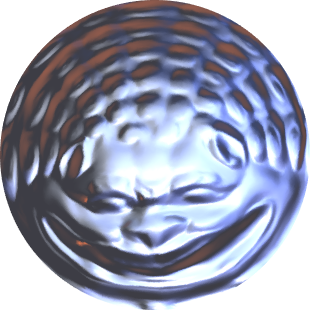

<h1 align="left"> Disk-Shaped Area-Preserving Parameterization</h1>

  
  

 

This repository provides an implementation of a convergent energy minimization method for disk-shaped area-preserving parameterization of open triangular meshes.

If you use this code in your own work, please cite the following paper:

> [1] **S.-Y. Liu** and **M.-H. Yueh**,  
> *Convergent Authalic Energy Minimization for Disk Area-Preserving Parameterizations*,  
> [doi: 10.1007/s10915-024-02594-2](https://doi.org/10.1007/s10915-024-02594-2).

---

### Main Function
`[uv, VB, VI] = DiskAEM(F, V)`

Required Input:
- `F`: `#F x 3` triangulations of an open triangle mesh
- `V`: `#V x 3` vertex coordinates of an open triangle mesh

Output:
- `uv`: `#V x 2` vertex coordinates of the disk-shaped area-preserving map
- `VI`: indices of interior vertices
- `VB`: indices of boundary vertices

Optional Input:
- `DiskAEM( __, "MaxIter", Value)`: the maximum iterative number (default: 200)
- `DiskAEM( __, "Tol", Value)`: the tolerance of objective function deficit (default: 1e-6)

---

### License

This software is released for academic and research purposes only.  
Commercial use is not permitted without prior written permission from the authors.

© 2024 Shu-Yung Liu and Mei-Heng Yueh
